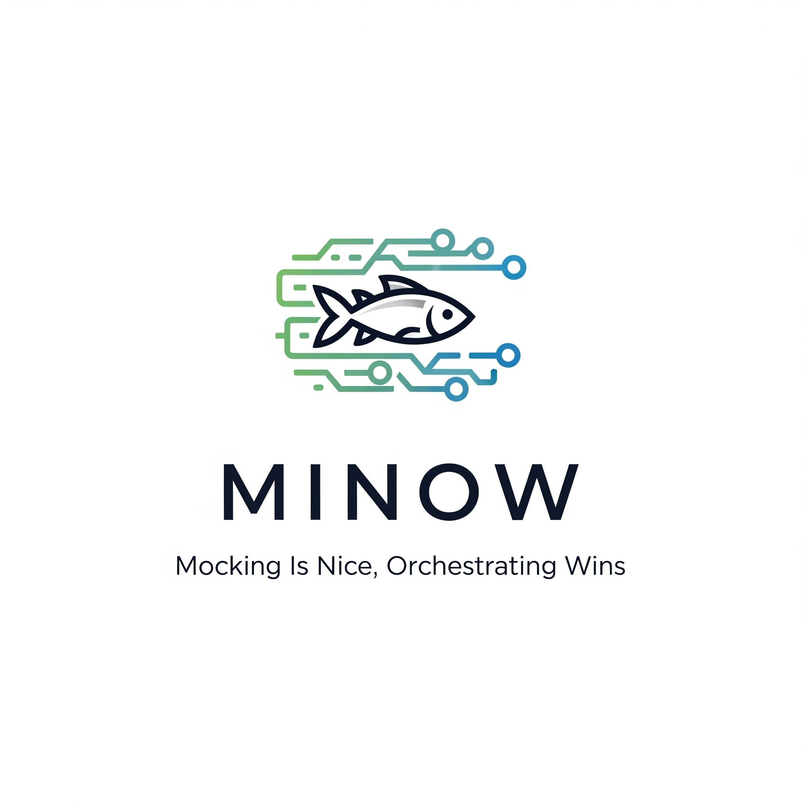

# MINOW
## Խելացի երթուղիչ ֆունկցիոնալ թեստավորման համար

Minow-ը խելացի երթուղիչ է, որը լուծում է ֆունկցիոնալ թեստավորման հիմնական խնդիրներից մեկը՝ **արտաքին ծառայությունների անկայունությունն ու անկանխատեսելիությունը**։ Այն օգնում է հաղթահարել ծանրաբեռնվածության սահմանափակումները և հեշտությամբ վերարտադրել հազվադեպ, դժվար հայտնաբերվող սխալները, ինչպիսիք են 429-ը (Too Many Requests) կամ այլ արտակարգ իրավիճակներ։

Minow-ը չի փոխարինում ձեր կոդը, այլ օգնում է կառավարել թեստային սցենարները՝ ճիշտ պահին տրամադրելով ճշգրիտ և վերահսկվող տվյալներ։

---

## 🎯 Minow-ի փիլիսոփայությունը

Մեր փիլիսոփայությունը պարզ է՝ **ավանդական մոքերը լավն են, բայց նվագախմբությունը հաղթում է։**

Minow-ն ապահովում է արտաքին ծառայությունների կայունությունն ու կանխատեսելիությունը թեստավորման ընթացքում՝ ազատելով ձեզ բարդ և անվստահելի խցաններ գրելուց։ Այն թույլ է տալիս **վերարտադրել կողմնակի համակարգերի վարքագծի որոշակի սցենարներ**, ինչը գրեթե անհնար է անել իրական պայմաններում, օրինակ՝ 429 սխալ ստանալ երկրորդ հարցմանը կամ 500՝ հաջող հարցումների շարքից հետո։

Minow-ը **խելացի երթուղիչ է պահեստով**, այլ ոչ թե տվյալների գեներատոր։ Մենք հավատում ենք, որ ձեր տվյալները պետք է նախապես պատրաստվեն, իսկ մեր գործն է դրանք արդյունավետ և հուսալի կերպով հասցնել ճիշտ վայրը։

### Ինչ է անում Minow-ը.
✅ Պահպանում է ձեր թեստային տվյալները մեկուսացված տարածքում
✅ Արտազատում է բանալիներն ու փոփոխականները մուտքային հարցումներից
✅ Ուղղորդում է հարցումները ձեր տվյալների հիման վրա
✅ Ձևափոխում է հարցումներն ու պատասխանները
✅ **Թույլ է տալիս վերարտադրել արտակարգ իրավիճակներ և սխալներ**

### Ինչ ՉԻ անում Minow-ը.
❌ Չի գեներացնում բարդ տվյալներ
❌ Չի իրականացնում բիզնես տրամաբանություն
❌ Չի կատարում բարդ հաշվարկներ
❌ Չի փոխարինում ձեր կոդը

---

## ⚙️ Ճարտարապետական սկզբունքներ

Minow-ը նախագծված է՝ հաշվի առնելով պարզության և կանխատեսելիության սկզբունքները։

### Գծային հոսք (Linear Pipeline)
Հարցման մշակումը բաժանված է հաջորդական փուլերի՝ վերացնելով շրջանաձև կախվածությունները։ Մի փուլում ստեղծված փոփոխականները կարող են օգտագործվել միայն հաջորդ փուլերում՝ ստեղծելով տվյալների միակողմանի հոսք։

### Փոփոխականների հաշվարկման գծային կարգ
Փոփոխականը կարող է վկայակոչել միայն այն փոփոխականներին, որոնք հայտարարվել են իրենից վեր կոնֆիգուրացիայում։ Այս պարզ կանոնը երաշխավորում է, որ հանգույցներ չեն լինի։

### Նվազագույն բավարարության սկզբունք
Յուրաքանչյուր ֆունկցիա կատարում է ճիշտ մեկ խնդիր։ Մենք չենք ավելացնում հնարավորություններ «ամեն դեպքի համար»՝ միայն նրանք, որոնք լուծում են թեստավորման իրական խնդիրներ։

---

## 🚀 Հիմնական առավելությունները

### Կանխատեսելիություն
Գծային ճարտարապետության շնորհիվ համակարգի վարքագիծը միշտ կարելի է կանխատեսել։ Չկան թաքնված կախվածություններ կամ անսպասելի կողմնակի ազդեցություններ, և **ձեր թեստերը դառնում են կայուն և անկախ արտաքին գործոններից**։

### Դեբագինգի պարզություն
Գծային մշակման հոսքը խնդիրների ախտորոշումը դարձնում է պարզունակ խնդիր։ Դուք ճշգրիտ գիտեք, թե **ինչու և ինչպես է վերադարձվել տվյալ պատասխանը**, նույնիսկ եթե դա հազվադեպ դեպք էր։

### Պարզություն և մասշտաբայնություն
Կոնֆիգուրացիաները մնում են ընթեռնելի և կառավարելի նախագծերի աճին զուգահեռ։ Թիմի նոր անդամները արագորեն հասկանում են համակարգը՝ շնորհիվ դրա պարզ և հետևողական սկզբունքների։

---

## 🎪 Նվագախմբության փիլիսոփայությունը

Պատկերացրեք թեստավորումը որպես սիմֆոնիկ նվագախումբ.
- **Ձեր կոդը** երաժիշտներն են։
- **Արտաքին ծառայությունները** նվագախմբի մյուս բաժիններն են։
- **Minow-ը** դիրիժորն է, որն ապահովում է բոլոր մասերի ճիշտ փոխգործակցությունը։

Դիրիժորը գործիքներ չի նվագում, բայց առանց նրա համերաշխ կատարումն անհնար է։ Նմանապես, Minow-ը չի փոխարինում ձեր կոդը, բայց ապահովում է բոլոր բաղադրիչների ճիշտ փոխգործակցությունը թեստավորման ընթացքում։

---

## 🔄 Հարցման կյանքի ցիկլը

1. **Ընդունում** -> Minow-ը ստանում է հարցում ձեր հավելվածից։
2. **Վերլուծություն** -> Այն արտազատում է հիմնական տվյալները։
3. **Որոշում** -> Այն որոշում է համապատասխան երթուղին։
4. **Ձևափոխում** -> Այն փոփոխում է հարցումը կամ պատասխանը ըստ անհրաժեշտության։
5. **Մատակարարում** -> Այն վերադարձնում է պատրաստված տվյալները։

---

## 🎯 Առաքելություն

Ստեղծել հարմար գործիք QA Automation-ի համար։ Վերջ։ Առանց աշխարհը փրկելու պաթոսի։

Մենք հեղափոխություն չենք անում արդյունաբերության մեջ։ Մենք պարզապես լուծում ենք կոնկրետ տեխնիկական խնդիր՝ ինչպես անել, որ ձեր ֆունկցիոնալ թեստերն աշխատեն կանխատեսելի, իսկ դրանց սպասարկումը սարսափ չդառնա։ Minow-ը պարզապես լավ է կատարում իր գործը և չի խանգարում ձեզ։